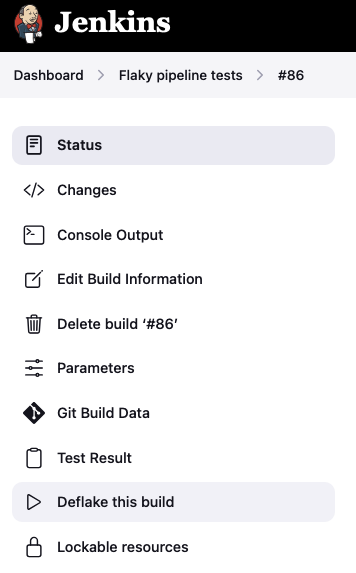
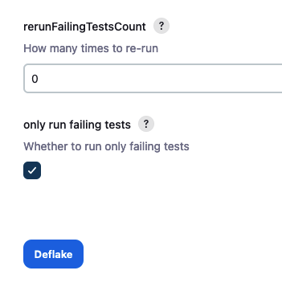
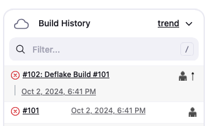
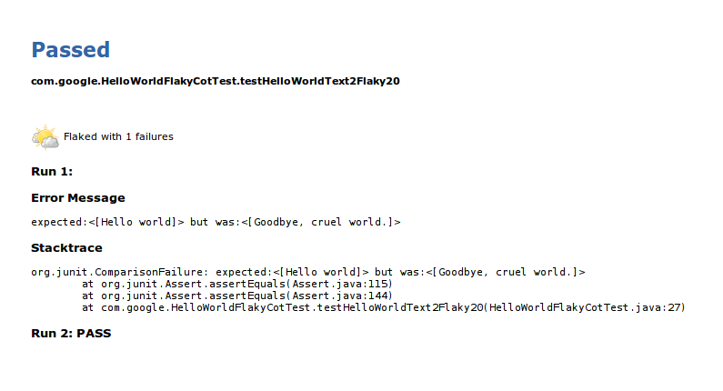
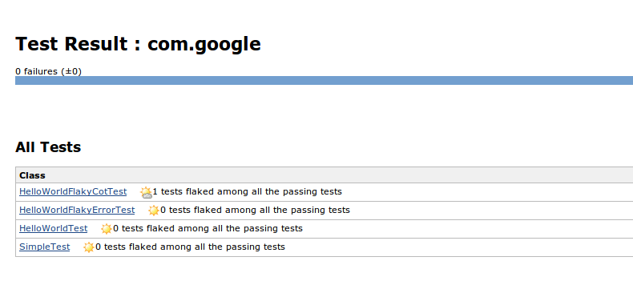
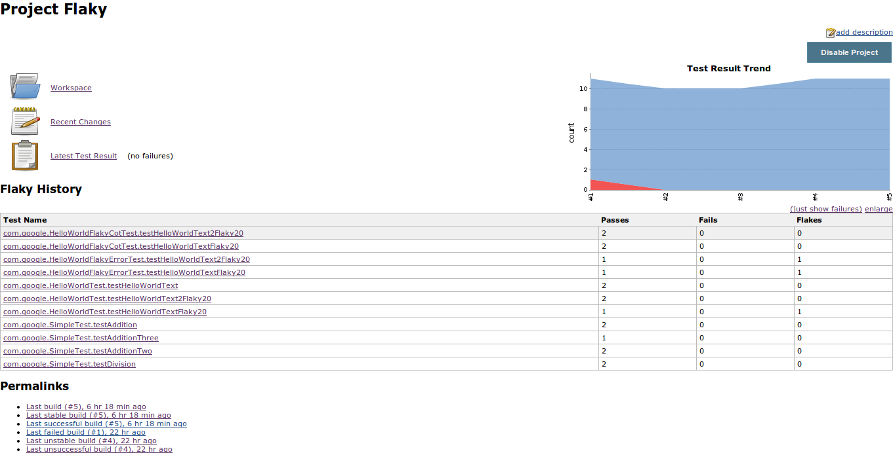
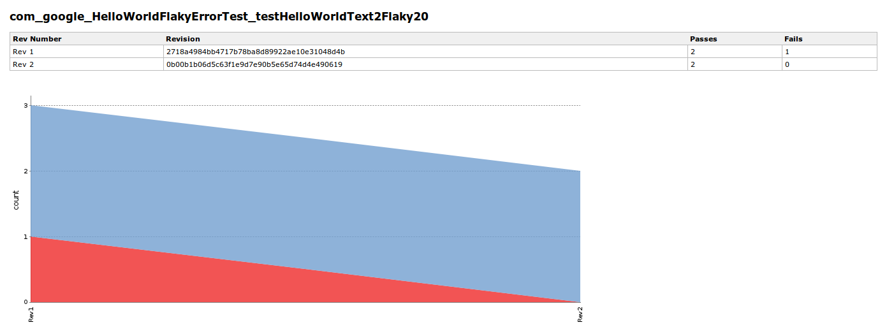
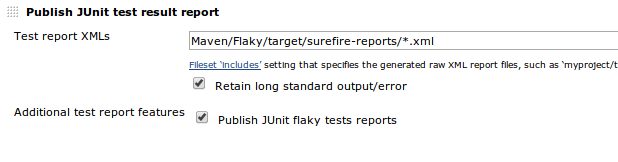
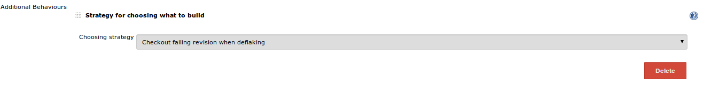

flaky-test-handler-plugin
=========================

## Introduction

A flaky test is a test which could fail or pass for the same
configuration. Flaky tests could be harmful for developers because their
failures do not always indicate bugs in the code.

This plugin is designed to handle flaky tests, including re-running
failed tests, aggregate and report flaky tests statistics and so on.

**Note: Currently most features of this plugin are designed for Git and Maven projects.**

## Features

### Publish re-run information for flaky tests

The plugin includes support for the "rerunFailingTestsCount" option of
the Maven surefire plug-in which produces additional data about test
flakiness. It lets users to choose to re-run failed tests up to N times,
and if it passes within any of those N times, the re-run will stop and
the test will be marked as a "Flake". The build will be marked as
successful if there is no failed tests but only "flaky" tests.

### "Deflake" Action for Builds with Failed Tests

The plugin provides a "Deflake" action. It is different from rebuilding the project, as it will:
1) (Optionally) Checkout the exact revision of that failing build
2) Only run all previously failed tests

After clicking "Deflake", there is another configuration window.

* **rerunFailingTestsCount**: Sets the number of automatic reruns of failed tests.
  However if this parameter is already set in the project pom.xml, then it
  cannot be overwritten.

* **only run failing tests**: when checked, the plugin will generate `-Dtest=...` to
  pass to Maven, so only previous failed tests will be re-run.

Deflake build will show up as **"Deflake Build \# ..."**.

### Statistics in Test Results

Display all the re-runs in the test result page:

Display flaky tests information in the test result table as a badge:

### Statistics over several builds

For each Git revision and each test, we count how many times it passed,
how many times it failed. So if a test passed and failed for the both
revision, we count it as a flake; if it always failed, then it's a fail,
otherwise it's a pass.

If Git is not used as scm, then we use build number as revision number.

## Usage

### Pipeline project type

Use junit pipeline plugin and choose "Publish JUnit flaky tests report" as **Additional test report features**.
The resulting syntax should look like this:

    junit testDataPublishers: [[$class: 'JUnitFlakyTestDataPublisher']], testResults: 'target/surefire-reports/TEST*.xml'

The plugin can also be used in pipelines together with the [junit-realtime-test-reporter](https://www.jenkins.io/doc/pipeline/steps/junit-realtime-test-reporter/) plugin:

    realtimeJUnit(keepLongStdio: true, testDataPublishers: [[$class: 'JUnitFlakyTestDataPublisher']], testResults: 'target/surefire-reports/TEST*.xml') {
        sh 'mvn ...'
    }

#### Configuration of "Deflake" Action in pipeline projects

To make "Deflake" action work in pipeline projects the parameters
**test** and **surefire.rerunFailingTestsCount** need to be passed
to maven. The below code also shows a workaround because currently
dots are not allowed in jenkins parameters in pipeline scripts:

    // This is needed because of https://issues.jenkins-ci.org/browse/JENKINS-7180
    def RERUN = currentBuild.getRawBuild().actions.find { it instanceof ParametersAction }?.parameters.find {
        it.name == 'surefire.rerunFailingTestsCount'
    }?.value

    sh """mvn
    -Dsurefire.rerunFailingTestsCount=${RERUN} \\
    -Dtest='${params.test}' \\
    clean integration-test"""

### Freestyle project type

After the plugin is installed and JUnit test report is published, check
on “Publish JUnit flaky test reports” under “Additional test report
features.

#### Configure checkout strategy of "Deflake" Action in freestyle projects

When configuring project's scm with Git plugin, use Add button to add
"Strategy for choosing what to build", and then select "Checkout failing
revision when deflaking".

This will tell the plugin to checkout the exact failing revision when
deflaking a failed build.

#### Aggregating Tests Statistics over Revisions

Add “Publish JUnit flaky stats” as a post build step

**Note**: This feature requires JUnit test result report being
published, and this step has to be placed **after** “Publish JUnit test
result report”.
